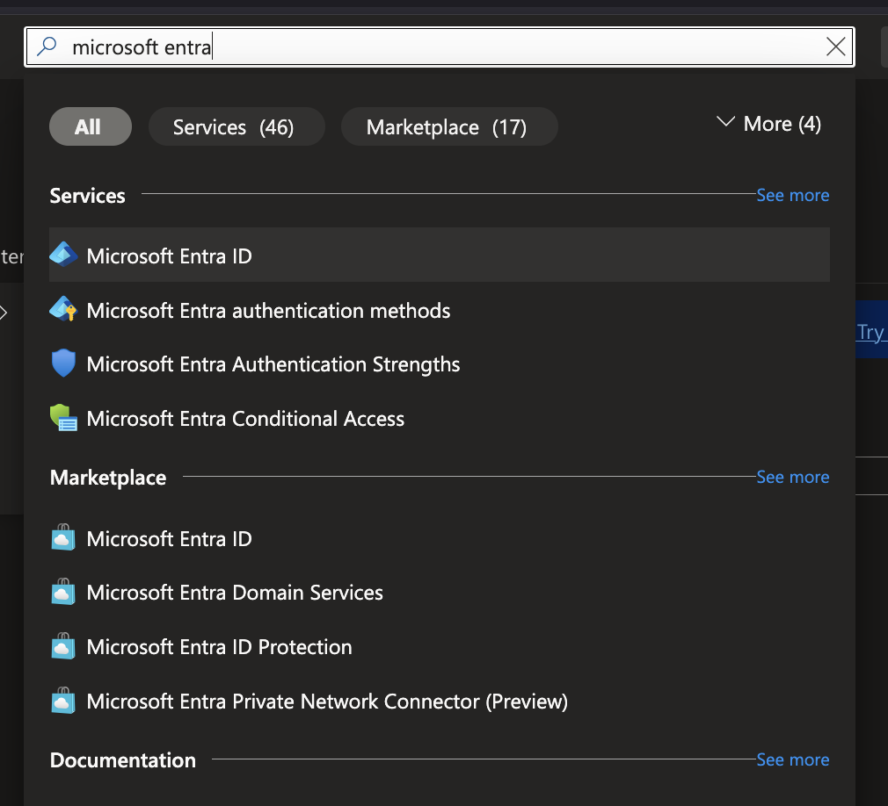
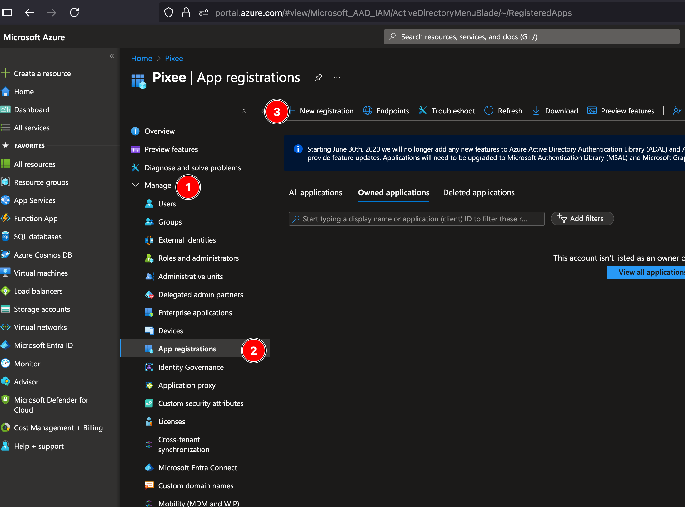
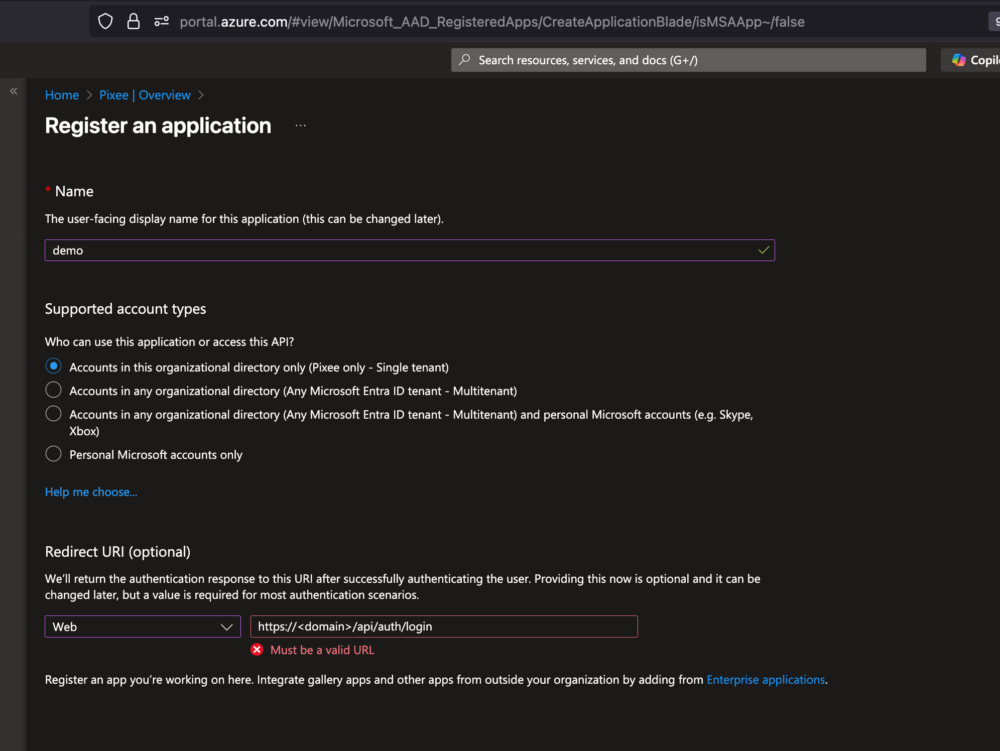
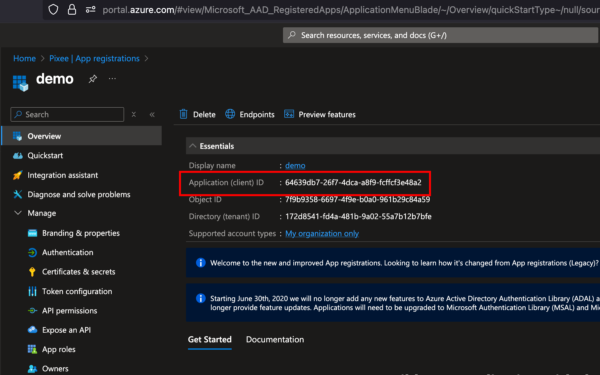
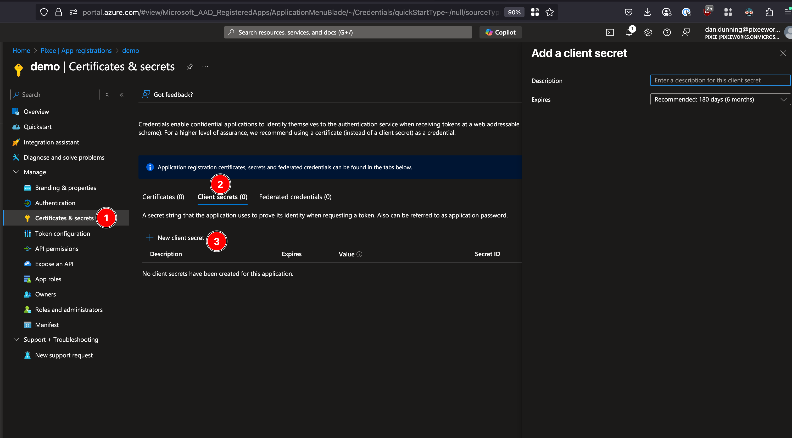
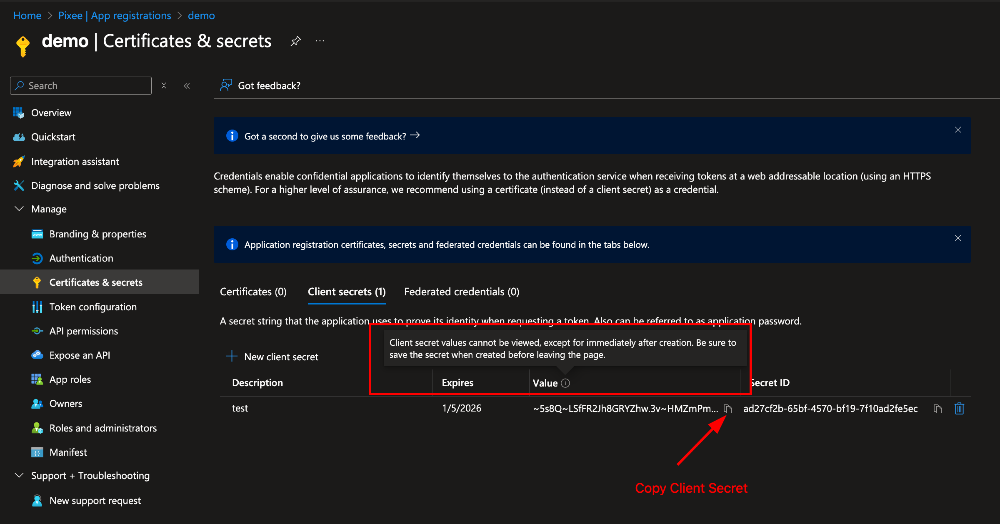
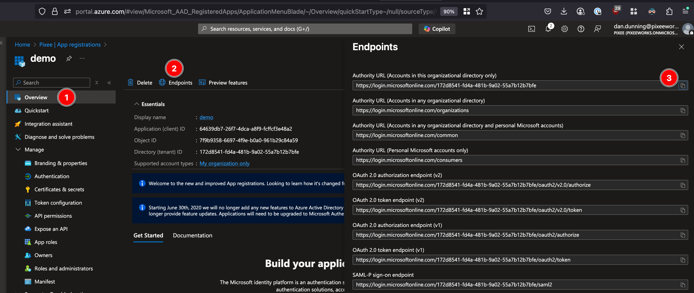
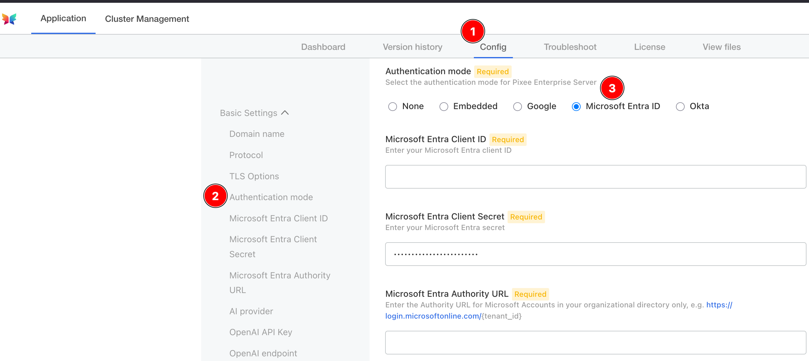

# Authentication

Pixee Enterprise Server supports multiple authentication providers. This section covers configuration for all supported authentication methods.

<Note>
Support for OIDC compatible identity providers is in active development, contact support@pixee.ai to request additional support.
</Note>

## Embedded Identity Provider (Authentik)

Pixee Enterprise Server includes [Authentik](https://goauthentik.io/){:target="\_blank"} as an embedded identity provider. This provides a full-featured identity management solution without requiring an external OIDC provider.

### Features

- User management with web-based admin interface
- Support for local users and passwords
- Federation with external identity providers (Google Workspace, Oracle, etc.)
- Self-service password change
- Session management
- Pixee-branded login experience

<Note title="Email / SMTP Support">
To enable email features such as self-service password reset, email verification, and notification emails, configure the **SMTP / Email Settings** section in the admin console. An SMTP server (e.g., your organization's mail relay, Gmail, SendGrid) is required. Without SMTP configured, password resets must be performed by an administrator through the Authentik admin interface or by using the recovery key command described below.
</Note>

### Configuration

{{#if entitlements.isEmbeddedClusterDownloadEnabled}}

**Embedded Cluster**

To enable Authentik in Embedded Cluster deployments:

1. Navigate to the admin console, select the `Config` tab, then go to the `Basic Settings` section
2. Under `Authentication mode`, select **"Authentik"**
3. Save and deploy the configuration

After deployment, Authentik will automatically initialize with the Pixee OIDC application pre-configured. The default admin credentials are displayed in the config page.

{{/if}}

{{#if entitlements.isHelmInstallEnabled}}

**Helm Deployment**

To enable Authentik in Helm deployments, set the following in your `values.yaml`:

```yaml
authentik:
  enabled: true
  authentik:
    secret_key: "<generate a secure random string - must not change after install>"
    bootstrap:
      password: "<initial admin password for akadmin user>"
    postgresql:
      host: "<postgresql-host>"
      name: "authentik"
      user: "authentik"
      password: "<database-password>"
    redis:
      host: "<redis-host>"
      port: 6379
  # Inject the OIDC client secret into the Authentik worker so the blueprint can
  # read it via !Env. References the same secret used by the platform.
  worker:
    env:
      - name: PIXEE_OIDC_CLIENT_SECRET
        valueFrom:
          secretKeyRef:
            name: oidc-client-secrets
            key: secret

global:
  pixee:
    access:
      enabled: true
      oidc:
        client:
          id: "pixee"
          secret: "<generate a secure random string>"
        redirectUri: "https://<your-domain>/api/auth/callback"
```

{{/if}}

### Initial Setup

After deploying with Authentik enabled:

{{#if entitlements.isEmbeddedClusterDownloadEnabled}}

**Embedded Cluster**

1. **Access the admin interface** by navigating to:

   ```
   https://<your-domain>/authentik/
   ```

   Log in with username `akadmin` and the password shown in the admin console config page (your license ID). After logging in, click the **Admin interface** button to access user management.

2. **Change the admin password** (recommended) - Navigate to Directory > Users, select `akadmin`, and update the password. This change will persist across upgrades.

3. **Create additional users** as needed through the Authentik admin interface

{{/if}}

{{#if entitlements.isHelmInstallEnabled}}

**Helm Deployment**

1. **Find the admin password** in your `values.yaml` under `authentik.authentik.bootstrap_password`

2. **Access the admin interface** by navigating to:

   ```
   https://<your-domain>/authentik/
   ```

   Log in with username `akadmin` and the configured password, then click the **Admin interface** button.

3. **Create additional users** as needed through the Authentik admin interface

{{/if}}

<Tip title="Recovery Access">
If you need to reset a user's password, the easiest way is to create a recovery link from the Authentik admin UI:

1. Navigate to **Directory** → **Users** and select the user
2. Click **Create Recovery Link** — you can set how long the link stays valid (default: 30 minutes)
3. Send the link to the user; they will be prompted to set a new password

As a CLI fallback, you can generate a recovery link via kubectl:

```bash
kubectl exec -n <namespace> deploy/<release-name>-authentik-server -- ak create_recovery_key 30 akadmin
```

This generates a recovery URL valid for 30 minutes.
</Tip>

<Note title="Upgrades and Persistence">
- User accounts, passwords, and settings are stored in the Authentik database and persist across upgrades
- Password changes made by users or admins will not be overwritten during upgrades
- The OIDC application configuration is managed declaratively and will be updated automatically during upgrades
</Note>

<Tip title="Using Authentik behind a load balancer on a non-standard port">
If your Pixee Enterprise Server is accessed through a load balancer on a non-standard port (e.g., port 5443), you must configure the reverse proxy settings for OIDC authentication to work correctly. See [Reverse Proxy Settings — Non-Standard Port](../installation/advanced-settings.md#non-standard-port-load-balancer) for setup instructions.
</Tip>

### User Management

Users are managed through the Authentik admin interface at `https://<your-domain>/authentik/if/admin/`.

#### Creating Users

1. In the admin interface, go to **Directory** → **Users** and click **Create**
2. Fill in the user's details (username, display name, email) and click **Create**
3. After creating the user, select them and click **Create Recovery Link** to generate a one-time password setup link — you can choose how long the link stays valid
4. Send the recovery link to the user; they will be prompted to set their password on first visit

For more details, see the Authentik documentation on [creating users](https://docs.goauthentik.io/users-sources/user/user_basic_operations/#create-a-user){:target="\_blank"} and [creating recovery links](https://docs.goauthentik.io/users-sources/user/user_basic_operations/#1-create-a-recovery-link){:target="\_blank"}.

#### Editing and Deleting Users

- Go to **Directory** → **Users**, select a user, and update their details or deactivate their account
- Users created here can log in to Pixee Enterprise Server

### Federating External Identity Providers

Authentik supports federating external identity providers so users can log in with their existing corporate credentials. After creating a source for your identity provider (see provider-specific sections below), you must add it to the login page.

#### Adding a Source to the Login Page

This step is the same for all federated identity providers. After creating a source in Authentik:

1. In the Authentik admin interface, go to **Flows and Stages** → **Flows**
2. Click on **default-authentication-flow**
3. Go to the **Stage Bindings** tab
4. Click **Edit Stage** on the **default-authentication-identification** stage
5. Under **Source settings**, add your identity provider source to the **Selected sources** field
6. Click **Update** to save

Users will now see the identity provider as a login option on the Authentik login page.

#### Google OAuth

Pixee Enterprise Server supports Google as an identity provider using OAuth 2.0 / OpenID Connect. This works with any Google account (personal Gmail or Google Workspace).

##### Step 1: Create OAuth Credentials in Google Cloud Console

1. Go to [Google Cloud Console](https://console.cloud.google.com/){:target="\_blank"} and select or create a project
2. Go to **APIs & Services** → **Credentials** → **Create Credentials** → **OAuth client ID**
3. If prompted, configure the **OAuth consent screen** first:
   - **User Type**: Internal (for Google Workspace) or External (for any Google account)
   - **App name**: `Pixee Enterprise Server`
   - **Authorized domains**: add your domain (e.g., `getpixee.com`)
4. Create the OAuth client ID:
   - **Application type**: Web application
   - **Name**: `Pixee Enterprise Server`
   - **Authorized redirect URIs**: `https://<your-domain>/authentik/source/oauth/callback/google/`
5. Copy the **Client ID** and **Client Secret**

##### Step 2: Create an OAuth Source in Authentik

1. In the Authentik admin interface, go to **Directory** → **Federation and Social login** → **Create** → **Google OAuth Source**
2. Configure:
   - **Name**: `Google` (or `Google Workspace`)
   - **Slug**: `google`
   - **Consumer Key**: your Client ID from Step 1
   - **Consumer Secret**: your Client Secret from Step 1
3. Click **Create**

After creating the source, [add it to the login page](#adding-a-source-to-the-login-page).

##### Optional: Auto-Map Username from Email

By default, users logging in with Google for the first time are prompted to choose a username. To automatically set the username from their email address (e.g., `john.smith` from `john.smith@example.com`):

1. Go to **Customization** → **Property Mappings** → **Create** → **OAuth Source Property Mapping**
2. Configure:
   - **Name**: `Google Email to Username`
   - **Expression**:

     ```python
     return {"username": info.get("email", "").split("@")[0]}
     ```

3. Go to **Directory** → **Federation and Social login** → edit the Google OAuth source
4. Under **User Property Mappings**, add **Google Email to Username** to the selected mappings
5. Click **Update**

New users will now be assigned a username automatically based on their Google email.

#### Google Workspace (SAML)

Pixee Enterprise Server supports Google Workspace as an external identity provider using SAML.

##### Step 1: Create a SAML App in Google Workspace

1. Go to **Google Admin Console** (`admin.google.com`) → **Apps** → **Web and mobile apps** → **Add app** → **Add custom SAML app**
2. Enter a name (e.g., `Pixee Enterprise Server`) and click **Continue**
3. Copy the **SSO URL** and **Certificate** from Google — you will need these for the Authentik source configuration
4. Under **Service Provider Details**, set:
   - **ACS URL**: `https://<your-domain>/authentik/source/saml/google/acs/`
   - **Entity ID**: `https://<your-domain>/authentik/source/saml/google/metadata`
   - **Name ID format**: `EMAIL`
   - **Name ID**: `Basic Information > Primary email`

5. Check the **Signed response** checkbox
6. Click **Continue**, then **Finish**

<Warning title="Enable the app for users">
By default, new SAML apps in Google Workspace are **OFF for everyone**. You must turn it on:

1. Click on the newly created app
2. Click **User access**
3. Set the service status to **ON for everyone** (or for the appropriate organizational units)
4. Click **Save**
   </Warning>

##### Step 2: Create a SAML Source in Authentik

Follow the Authentik documentation for [Google Workspace SAML integration](https://docs.goauthentik.io/users-sources/sources/social-logins/google/workspace/){:target="\_blank"} to create a SAML source using the SSO URL and Certificate from Step 1.

1. In the Authentik admin interface, go to **Directory** → **Federation and Social login** → **Create** → **SAML Source**
2. Set the **Name** (e.g., `Google Workspace`) and **Slug** (e.g., `google`)
3. Set the **Icon** field to `/static/authentik/sources/google.svg` so the Google logo appears on the login page
4. Set the **SSO URL** to the value copied from Google (e.g., `https://accounts.google.com/o/saml2/idp?idpid=<your-idp-id>`)
5. Set the **Binding Type** to **Redirect** (required for [auto-redirect](#auto-redirect-to-identity-provider) to work)
6. Upload the **Signing Certificate** downloaded from Google

After creating the source, [add it to the login page](#adding-a-source-to-the-login-page).

##### Troubleshooting

- **`403 app_not_configured_for_user`**: This means either the Entity ID doesn't match or the app isn't enabled for the user. Verify that the **Entity ID** in Google Admin Console **exactly matches** the Authentik metadata URL (case-sensitive), and that the app is turned **ON** for the user's organizational unit.
- **`No Signature exists in the Response element`**: Enable the **Signed response** checkbox in the Google Admin Console SAML app under **Service Provider Details**.
- **"Permission denied" on login**: Verify the Pixee application in Authentik is linked to the `pixee` provider. Check **Applications** > **Pixee Enterprise Server** > **Provider** assignment.

#### Oracle Identity Domains (OAuth)

Pixee Enterprise Server supports Oracle Identity Domains as an external identity provider using OAuth/OIDC.

##### Step 1: Create a Confidential Application in Oracle

1. Go to **OCI Console** > **Identity & Security** > **Domains** and select your domain
2. Navigate to **Integrated applications** > **Add application** > **Confidential Application**
3. Enter a name (e.g., `Pixee Enterprise Server`) and click **Next**
4. Under **Client configuration**, check **"Configure this application as a client now"**
5. Set **Allowed Grant Types** to **Authorization Code**
6. Set **Redirect URL** to:

   ```
   https://<your-domain>/authentik/source/oauth/callback/oracle/
   ```

7. Leave **Token issuance policy** set to **All**
8. Click **Finish**, then **Activate** the application
9. Copy the **Client ID** and **Client Secret**

<Warning>
Do **not** register Authentik as a Social Identity Provider in Oracle. Oracle should handle password authentication directly.
</Warning>

##### Step 2: Configure Authentik Federation

Follow the Authentik documentation for [creating an OAuth Source](https://docs.goauthentik.io/users-sources/sources/protocols/oauth/){:target="\_blank"} using the **OpenID Connect** type.

When configuring the source, use the Client ID and Client Secret from Step 1. Your Oracle OIDC endpoint URLs follow this pattern (replace `<your-idcs-instance>` with your domain identifier):

- **Authorization URL**: `https://<your-idcs-instance>.identity.oraclecloud.com/oauth2/v1/authorize`
- **Access token URL**: `https://<your-idcs-instance>.identity.oraclecloud.com/oauth2/v1/token`
- **Profile URL**: `https://<your-idcs-instance>.identity.oraclecloud.com/oauth2/v1/userinfo`

You can find these values in your Oracle OIDC discovery document at `https://<your-idcs-instance>.identity.oraclecloud.com/.well-known/openid-configuration`.

<Note>
All three endpoint URLs must be set explicitly on the source. Do not rely solely on the OIDC Well-known URL to auto-populate them.
</Note>

After creating the source, [add it to the login page](#adding-a-source-to-the-login-page).

##### Troubleshooting

- **"Permission denied" on login**: Verify the Pixee application in Authentik is linked to the `pixee` provider. Check **Applications** > **Pixee Enterprise Server** > **Provider** assignment.
- **Redirect loop on Oracle login**: Ensure the Authorization, Token, and Profile URLs are all explicitly set on the Oracle source. If any are blank, the redirect loops back to Authentik.
- **Oracle shows Authentik login button**: Remove any Social Identity Provider entries for Authentik from Oracle under **Security** > **Identity providers**.

#### LDAP

Pixee Enterprise Server supports LDAP directories as an authentication source through Authentik's LDAP federation. Users authenticate with their existing LDAP credentials — Authentik verifies passwords directly against the LDAP server and syncs user accounts automatically.

##### Prerequisites

Gather the following from your LDAP administrator:

- **Server URL**: `ldap://ldap.example.com` or `ldaps://ldap.example.com` (LDAPS recommended for production)
- **Bind DN**: A service account DN for searching the directory (e.g., `cn=svc-pixee,ou=service-accounts,dc=example,dc=com`)
- **Bind Password**: Password for the service account
- **Base DN**: Where to search for users (e.g., `dc=example,dc=com`)
- **User Object Filter**: LDAP filter for user objects (e.g., `(objectClass=person)`)
- **Group Object Filter**: LDAP filter for group objects (e.g., `(objectClass=groupOfUniqueNames)`)

<Tip title="Network Access">
The Pixee Enterprise Server cluster must be able to reach the LDAP server. The default ports are 389 (LDAP) and 636 (LDAPS), but non-standard ports are supported via the Server URI (e.g., `ldap://ldap.example.com:3389`). Verify network connectivity and firewall rules before configuring.
</Tip>

##### Step 1: Create an LDAP Source in Authentik

1. In the Authentik admin interface, go to **Directory** → **Federation and Social login** → **Create** → **LDAP Source**
2. Configure the connection settings:
   - **Name**: A descriptive name (e.g., `Corporate LDAP`)
   - **Slug**: `ldap` (or a descriptive slug like `corporate-ldap`)
   - **Server URI**: Your LDAP server URL (e.g., `ldaps://ldap.example.com`)
   - **Bind CN**: The service account DN
   - **Bind Password**: The service account password
   - **Base DN**: The search base for your directory (e.g., `dc=example,dc=com`)

3. Configure the search settings:
   - **User Property Mappings**: Select all the default LDAP property mappings (these map LDAP attributes to Authentik user fields)
   - **Group Property Mappings**: Select the default LDAP group property mappings
   - **User object filter**: LDAP filter for user objects (e.g., `(objectClass=person)`) — adjust for your directory
   - **Group object filter**: LDAP filter for group objects (e.g., `(objectClass=groupOfUniqueNames)`) — adjust for your directory
   - **Group membership field**: `member` (or `uniqueMember` depending on your directory schema)
   - **Object uniqueness field**: `uid` (adjust for your directory)

4. Under password settings, ensure the following are **disabled**:
   - **Update internal password on login**: When enabled, Authentik stores a copy of the user's LDAP password internally. Disable this so that passwords are always verified directly against the LDAP server.
   - **User password writeback**: When enabled, password changes in Authentik are written back to the LDAP server. Disable this unless you want users to change their LDAP password through Authentik.

5. Click **Create**

##### Step 2: Verify User Sync

After creating the LDAP source, trigger a sync and verify:

1. Go to **Directory** → **Federation and Social login**, click on your LDAP source, and click **Run sync**
2. Go to **Directory** → **Users** and verify that LDAP users have been imported
3. Go to **Directory** → **Groups** and verify that LDAP groups have been imported

If users are not appearing after sync, check the sync logs:

1. In the Authentik admin interface, go to **Events** → **Logs**
2. Look for entries with action `configuration_error` — these indicate sync failures with details about what went wrong
3. Alternatively, check the Authentik worker pod logs directly:

   ```bash
   kubectl logs -n <namespace> deploy/<release-name>-authentik-worker --tail=200 | grep -i "ldap\|configuration_error\|username"
   ```

   Common errors in the logs include:
   - **"Username was not set by propertymappings"**: Ensure a property mapping that sets the `username` field is selected on the LDAP source under **User Property Mappings**
   - **"Could not find page in cache"**: The sync pagination timed out — try running the sync again, or increase the `ldap.task_timeout_hours` setting
   - **"LDAPServerPoolExhaustedError"**: Authentik cannot connect to the LDAP server — check network connectivity and TLS settings

<Note title="Sync Schedule">
By default, Authentik syncs LDAP users and groups periodically (every 120 minutes). You can trigger a manual sync at any time from the LDAP source configuration page. Adjust the sync frequency in the LDAP source's **Advanced settings** if needed.
</Note>

##### Step 3: Add LDAP to the Login Page

After creating the source, [add it to the login page](#adding-a-source-to-the-login-page).

Once added, users will see an LDAP login option. When a user enters their LDAP credentials, Authentik authenticates them directly against the LDAP server.

<Note title="How LDAP Authentication Works">
When users log in via the LDAP source, Authentik performs a bind operation against the LDAP server using the user's credentials. With the recommended password settings above (both disabled), passwords are not stored in Authentik and are always verified directly against the LDAP server. If a user changes their LDAP password, the change takes effect immediately.
</Note>

##### Troubleshooting

- **"Connection refused" or timeout**: Verify network connectivity from the cluster to the LDAP server. Check that the correct port (389 for LDAP, 636 for LDAPS) is open.
- **"Invalid credentials" on bind**: Verify the Bind DN and password.
- **"Username was not set by propertymappings"**: Ensure a property mapping that sets the `username` field is selected on the LDAP source under **User Property Mappings**.
- **No users synced**: Check the Base DN and user object filter. Use `ldapsearch` to verify the filter returns results from outside the cluster.
- **Users synced but cannot log in**: Ensure the LDAP source is added to the login page identification stage (see [Adding a Source to the Login Page](#adding-a-source-to-the-login-page)).
- **"Permission denied" after LDAP login**: Verify the Pixee application in Authentik is linked to the `pixee` provider. Check **Applications** > **Pixee Enterprise Server** > **Provider** assignment.
- **TLS/certificate errors with LDAPS**: If using a self-signed or internal CA certificate, you may need to add the CA certificate to the Authentik server's trust store.

### Auto-Redirect to Identity Provider

By default, when a federated identity provider is added as a source, users see the Authentik login page with both username/password fields and the identity provider button. To skip this page and redirect users directly to the identity provider, configure the identification stage to auto-redirect:

1. In the Authentik admin interface, go to **Flows and Stages** → **Stages**
2. Edit **default-authentication-identification**
3. Under **User fields**, **deselect all fields** (remove Username, Email, etc.)
4. Under **Sources**, ensure **only** the identity provider source is selected
5. Ensure the **Passwordless flow** field is **not set** (empty/none) — auto-redirect only works when this is unset
6. Click **Update** to save

With no user fields and exactly one source configured, Authentik automatically redirects users to the identity provider without showing the login page.

<Note title="SAML Binding Type">
For SAML sources, ensure the **Binding Type** on the source is set to **Redirect** rather than **POST**. With Redirect binding, Authentik performs a direct HTTP 302 to the identity provider. POST binding requires an intermediate page to submit the SAML request form.
</Note>

<Warning title="Multiple Identity Providers">
If more than one source is configured on the identification stage, auto-redirect is disabled and users will see a source selection page instead.
</Warning>

### Direct Login for Administrators

When auto-redirect is enabled, administrators who need to log in with username/password (e.g., the `akadmin` account) can no longer use the default login page. Create a separate authentication flow for direct login:

#### Create an Identification Stage

1. Go to **Flows and Stages** → **Stages** → **Create**
2. Select **Identification** as the stage type
3. Configure:
   - **Name**: `direct-authentication-identification`
   - **User fields**: select **Username**
   - **Sources**: leave empty (no identity provider buttons)
   - **Password stage**: select `default-authentication-password` (embeds the password field on the same page)
4. Click **Create**

#### Create the Direct Authentication Flow

1. Go to **Flows and Stages** → **Flows** → **Create**
2. Configure:
   - **Name**: `Direct Authentication Flow`
   - **Slug**: `direct-authentication-flow`
   - **Designation**: **Authentication**
   - **Required authentication level**: **Require no authentication**
3. Click **Create**

#### Bind Stages to the Flow

1. Click on the **direct-authentication-flow** flow to open it
2. Go to the **Stage Bindings** tab
3. Click **Bind existing Stage** and add the following bindings:

   | Order | Stage                                                  |
   | ----- | ------------------------------------------------------ |
   | 10    | `direct-authentication-identification` (created above) |
   | 30    | `default-authentication-mfa-validation` (built-in)     |
   | 100   | `default-authentication-login` (built-in)              |

   <Note>
   The `default-authentication-password` stage is **not** bound separately because it is already embedded in the identification stage (configured above). Adding it as a separate binding would prompt for the password twice.
   </Note>

4. Administrators can now log in directly at:

   ```
   https://<your-domain>/authentik/if/flow/direct-authentication-flow/
   ```

## Google Authentication

Pixee Enterprise Server supports Google authentication using OAuth 2.0.

### Configuration

You must set up a new OAuth client and retrieve the client ID and client secret. See the [Google Cloud Console](https://console.cloud.google.com/){:target="\_blank"} documentation for more information on creating a new OAuth 2.0 Client ID.

{{#if entitlements.isEmbeddedClusterDownloadEnabled}}

**Embedded Cluster**

To configure Google authentication in Embedded Cluster deployments follow:

Navigate to the admin console, select the `Config` tab, then go to the `Basic Settings` section.

Under `Authentication mode`, select Google as the provider and provide a client ID and client secret.

{{/if}}

{{#if entitlements.isHelmInstallEnabled}}

**Helm Deployment**

To configure Google authentication in Helm Deployment follow:

To enable Google authentication, set the following in your `values.yaml`:

```yaml
global:
  pixee:
    access:
      oidc:
        client:
          provider: google
          id: "<your Google oidc client id>"
          secret: "<your Google oidc client secret>"
```

{{/if}}

## Microsoft Entra Authentication

Pixee Enterprise Server supports Microsoft Entra authentication with single tenant applications.

### Create an App Registration

In order to set up OIDC for Microsoft you need to go to your [Microsoft Azure Portal](https://portal.azure.com/){:target="\_blank"},
and search for `Microsoft Entra ID`. Select `Microsoft Entra ID` under Services.

[](../images/authentication/microsoft_entra-search-for-entra.png)

Look for `Manage` on the left navigation bar, click on `App registrations` then click on `New registration`:
[](../images/authentication/microsoft_entra-steps-to-registration.png)

Fill in your application name, select the Single tenant option and add a `Web` Redirect URI as `https://<domain>/api/auth/login`, then click on Register:

[](../images/authentication/microsoft_entra-register-app.png)

### Retrieve App Registration Details

After creating the app registration, you will be redirected to the app's overview page. On this page you will find:

- **Application (client) ID**: Save this ID, which you will use as the `ClientID` in your Pixee configuration.

[](../images/authentication/microsoft_entra-client-id.png)

Then navigate to `Certificates & secrets` in the left navigation bar, and click on `New client secret` to create a new secret:
[](../images/authentication/microsoft_entra-create-client-secret.png)

**Client Secret**: After creating the client secret, copy the value immediately as it will not be shown again. This value will be used as the `ClientSecret` in your Pixee configuration:
[](../images/authentication/microsoft_entra-client-secret.png)

**Authority URL**: can be obtained from the "Endpoints" section of the App Registration:
[](../images/authentication/microsoft_entra-authority-url.png)

{{#if entitlements.isEmbeddedClusterDownloadEnabled}}

**Embedded Cluster**

To configure Microsoft Entra authentication in Embedded Cluster deployments follow:

Navigate to the admin console, select the `Config` tab, then go to the `Basic Settings` section.

Under `Authentication mode`, select Microsoft Entra as the provider and provide a client ID, client secret, and authority URL.
[](../images/authentication/microsoft_entra-embedded-cluster.png)

{{/if}}

{{#if entitlements.isHelmInstallEnabled}}

**Helm Deployment**

To configure Microsoft Entra authentication in Helm Deployment follow:

To enable Microsoft authentication, set the following in your `values.yaml`:

```yaml
global:
  pixee:
    access:
      oidc:
        client:
          provider: microsoft
          id: "<your Microsoft oidc client id>"
          secret: "<your Microsoft oidc client secret>"
          authServerUrl: "<your Microsoft oidc auth server url, such as https://login.microsoftonline.com/{tenant_id}>"
```

{{/if}}

## Okta Authentication

Pixee Enterprise Server supports Okta OIDC authentication.

### Configuration

You must create a new OIDC App Integration from the Okta Admin Console and retrieve the client ID, client secret, and Okta URL:

1. Log in to the Okta Admin Console as an administrator.
1. Navigate to **Applications** > **Applications** > **Add App Integration**.
1. Select **OIDC - OpenID Connect**, set **Application Type** to **Web Application**, and then click **Next**.
1. Configure the following required settings:
   1. **App Integration Name**: pixee
   1. **Sign-in redirect URIs**: https://< domain >/api/auth/login
1. Under **Assignments**, select how you'd like to control access to Pixee. Allow everyone in your organization to access or select a group to limit access.
1. Click **Save**.
1. Under **Client Credentials**, take note of the **Client ID**. This value will be required in the Pixee Admin Console.
1. Under **CLIENT SECRETS**, click the Copy to clipboard next to the secret and take note of the value, it will also be required in the Pixee Admin Console.

The Okta URL is of the form `https://{tenant-name}.okta.com`. You can verify this is correct by viewing the well-known OpenID Connect configuration at `https://{tenant-name}.okta.com/.well-known/openid-configuration`.

{{#if entitlements.isEmbeddedClusterDownloadEnabled}}

**Embedded Cluster**

To configure Okta authentication in Embedded Cluster deployments follow:

Navigate to the admin console, select the `Config` tab, then go to the `Basic Settings` section.

Under `Authentication mode`, select Okta as the provider and provide a client ID, client secret, and Okta URL.

{{/if}}

{{#if entitlements.isHelmInstallEnabled}}

**Helm Deployment**

To configure Okta authentication in Helm Deployment follow:

To enable Okta authentication, set the following in your `values.yaml`:

```yaml
global:
  pixee:
    access:
      oidc:
        client:
          provider: okta
          id: "<your Okta oidc client id>"
          secret: "<your Okta oidc client secret>"
          authServerUrl: "<your Okta oidc auth server url, such as https://{tenant-name}.okta.com>"
```

{{/if}}
